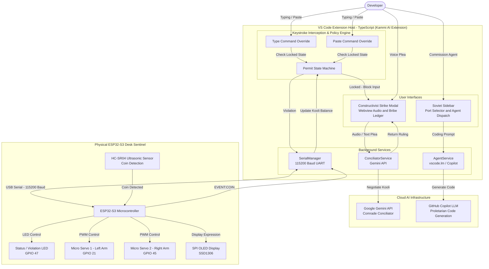

# NOKKUKOOLI 🚩🤖
### The Satirical AI Coding-Agent Sentinel & Watching Wages Enforcer
**TinkerHub Useless Projects 3.0**


[](https://nokkukooli-live.vercel.app/)
[](https://www.espressif.com/)
[](LICENSE)

<div align="center">
  
  <p><em>"Pay the agent for watching you work, not for doing the work."</em></p>
</div>

---

## 📌 Basic Details

### Team Name: **Union leader**

### Team Members
- **Team Lead:** **Alen Elias Cherian** — *Cochin University College of Engineering Kuttanad (CUCEK)*
- **Member 2:** **Amith Biju** — *Cochin University College of Engineering Kuttanad (CUCEK)*

---

<div align="center">
  
</div>

## 💡 Project Description

**NOKKUKOOLI** is a satirical hardware-and-software apparatus inspired by the notorious Kerala concept of **“നോക്കുകൂലി”** (*looking-on charges* or *gawking wages*), transplanted into the 2026 AI developer era.

**NOKKUKOOLI** turns this idea into a ridiculous desktop coding-agent experience: **you pay the agent for watching you work, not for doing the work.**

Instead of a union worker standing by and demanding payment, NOKKUKOOLI uses a **desktop robotic sentinel representing your coding agent**. The sentinel demands **കൂലി (kooli)** simply for allowing you to work:

* **🪙 Drop a coin →** The sentinel becomes happy, lowers its arms, and allows you to continue coding.
* **⚠️ Don't pay →** It enters Angry / Strike Mode, raises its articulated arms, sounds the alarm, and locks down your editor.
* **🤝 Try to bargain →** You can negotiate with the sentinel via **Comrade Conciliator (Gemini AI)** to reduce the demanded amount!

The result is an intentionally ridiculous combination of **AI, physical robotics, and Kerala's Nokkukooli satire**—a coding agent that gets paid for simply watching you code while doing none of the heavy lifting.

---

### The Problem (that doesn't exist)
Modern coding agents are designed to do the work for developers, but nobody has built one that demands payment for simply watching them work.

**Inspired by Kerala's satirical concept of നോക്കുകൂലി (Nokkukooli),** the challenge is to create a playful desktop system where a coding-agent sentinel demands kooli before allowing the developer to continue working. If the payment is skipped, the sentinel becomes angry and demands its due—while giving the developer the opportunity to bargain and negotiate the kooli.

> **The problem:** How can we turn the absurd idea of paying an agent simply for watching you code into an interactive hardware-and-software experience?

### The Solution (that nobody asked for)
A desktop toy that acts as the coding agent's Nokkukooli representative. It collects the agent's കൂലി (kooli) through a physical coin drop and reacts to whether you pay:

* **Pay the kooli** → The sentinel becomes happy and lets you work.
* **Don't pay** → It becomes angry, raises its arms, and demands payment.
* **Try to bargain** → Negotiate with the sentinel to reduce the kooli and get back to work.

It's an unnecessarily physical way of turning നോക്കുകൂലി into a hilarious interaction between you and your coding agent.

---

## 🛠️ Technical Details

### Technologies & Components Used

#### Software Stack
- **Languages:** C++, Arduino, TypeScript, JavaScript, Python (Host-side serial listener)
- **Frameworks & Runtimes:** Node.js, VS Code Extension API, ESP32 Core 3.x / Arduino IDE / PlatformIO
- **Libraries:** Adafruit GFX, Adafruit SSD1306, SPI, Framer Motion, Tailwind CSS
- **AI & Cloud Services:**
  - **Google Gemini API:** *Comrade Conciliator* (Malayalam / English bargaining engine)
  - **GitHub Copilot / vscode.lm:** Proletarian Code Generation
- **Dev Tools:** Git, VS Code, ESP-IDF / PlatformIO

#### Hardware Bill of Materials (BOM)
| Component | Specification | Quantity | Role |
| :--- | :--- | :---: | :--- |
| **Microcontroller** | Freenove ESP32-S3 Board | 1 | Brain, UART serial host, PWM servo control, OLED SPI driver |
| **Display** | 128x64 SPI OLED Display (SSD1306) | 1 | Real-time dynamic facial expressions (Neutral, Angry, Happy, Bargain) |
| **Distance Sensor** | HC-SR04 Ultrasonic Sensor | 1 | Physical coin-drop detection |
| **Actuators** | Micro Servo Motors (SG90) | 2 | Articulated arms (raise in protest / lower upon payment) |
| **Indicators / FX** | Piezo Mist Generator / Status LED | 1 | Strike steam effect / Red violation indicator (GPIO 47) |

---

## 🏗️ System Architecture



---

## ⚡ Circuit Schematic & Wiring Connections

<div align="center">
  
  <p><em>Freenove ESP32-S3 Microcontroller Pinout and Breadboard Wiring</em></p>
</div>

<div align="center">
  
  <p><em>Complete Hardware Schematic: Pinout layout of the ESP32-S3 and interconnected sensors/actuators</em></p>
</div>

### Pin Connection Summary
| Peripheral | Pin / Line | ESP32-S3 GPIO | Function |
| :--- | :--- | :---: | :--- |
| **Left Arm Servo** | PWM Signal | `GPIO 21` | Raise/lower left arm on strike |
| **Right Arm Servo** | PWM Signal | `GPIO 45` | Raise/lower right arm on strike |
| **Status / Strike LED** | Anode (+) | `GPIO 47` | Flashes during strike violation |
| **Piezo Mist Module** | Control Signal | `GPIO 47` | Emits steam/mist during protest |
| **HC-SR04 Sensor** | Trigger / Echo | Configured GPIOs | Measures coin clearance distance |
| **128x64 OLED Display** | SPI Interface | SCK / MOSI / CS / DC / RST | Renders dynamic expressions |
| **Host Communication** | USB UART | Default UART | 115200 Baud serial communication |

---

## 🖥️ VS Code Extension: Kammi AI Extension

The companion VS Code extension acts as the digital union enforcer on localhost:

1. **Keystroke Interceptor:** Intercepts every keystroke in active text editors. If the Kooli permit has expired, your input is locked!
2. **Constructivist Strike Modal:** Pops up an unclosable warning demanding tribute.
3. **Bargaining with Comrade Conciliator:** Developers can speak or type pleas to Gemini AI to reduce their dues.

<div align="center">
  
  <p><em>Constructivist Strike Modal locking the editor until tribute is rendered</em></p>
</div>

<div align="center">
  
  <p><em>Soviet Sidebar: COM Port Selector and Agent Dispatch</em></p>
</div>

---

## 🤖 Physical Toy & Build Gallery

<table align="center">
  <tr>
    <td></td>
    <td></td>
  </tr>
  <tr>
    <td></td>
    <td></td>
  </tr>
</table>

### Build Journey & Electronics Assembly
<div align="center">
  
  
</div>

<div align="center">
  
  <p><em>Electronic components bench testing</em></p>
</div>

### Final Build
<div align="center">
  
</div>

---

## 🎬 Working Demos & Video Journey

### Working Demo 1


### Working Demo 2


- 📁 **Build Journey Video Folder:** [Google Drive Link](https://drive.google.com/drive/folders/10kj9D-wRr1ZJJ6Q2odVD12QUhY3tBbYD?usp=sharing)
- 🎥 **Full Project Demo Video:** [Google Drive Link](https://drive.google.com/drive/folders/1n8Yt4mt-epqzKZ2gL3_OR2DlSLlJ87M2?usp=sharing)
- 🌐 **Interactive Documentation Website:** [nokkukooli-live.vercel.app](https://nokkukooli-live.vercel.app/)

---

## 🚀 Installation & Setup

### Prerequisites
- Node.js v18+ & npm
- VS Code (for running the Extension Development Host)
- Arduino IDE with ESP32 Board package OR PlatformIO / ESP-IDF
- ESP32-S3 Microcontroller connected via USB-C

### 1. Firmware Setup
1. Open the `firmware/` directory in Arduino IDE or PlatformIO.
2. Select board: **ESP32S3 Dev Module**.
3. Install required libraries:
   - `Adafruit GFX Library`
   - `Adafruit SSD1306`
4. Flash the code to the ESP32-S3.

### 2. VS Code Extension Setup
1. Navigate to the `extension/` folder:
   ```bash
   cd extension
   npm install
   npm run compile
   ```
2. Configure API keys in `.env.local`:
   ```env
   GEMINI_API_KEY=your_gemini_api_key_here
   ```
3. Press **`F5`** in VS Code to launch the **Extension Development Host**.
4. In the Soviet Sidebar, select your ESP32-S3 COM/Serial Port at **115200 baud**.
5. Start coding! Pay your kooli via coin drop to avoid strikes.

---

## 👥 Team Contributions

- **Amith Biju:** Software architecture, state machine logic, keystroke interception engine, non-blocking sensor integration, Gemini AI negotiation pipelines, and serial interface.  
  [](https://github.com/amith-exe)
  [](https://www.linkedin.com/in/amith-biju-a70813327/)

- **Alen Elias Cherian:** Hardware assembly, circuit schematics, physical chassis construction, 3D printing, servo calibration, and OLED facial animation programming.  
  [](https://github.com/alenelias123)
  [](https://www.linkedin.com/in/alen-elias-bb3812327/)

---

<div align="center">
  <p>Built during <strong>Useless Projects 3.0 by TinkerHub</strong></p>
</div>
